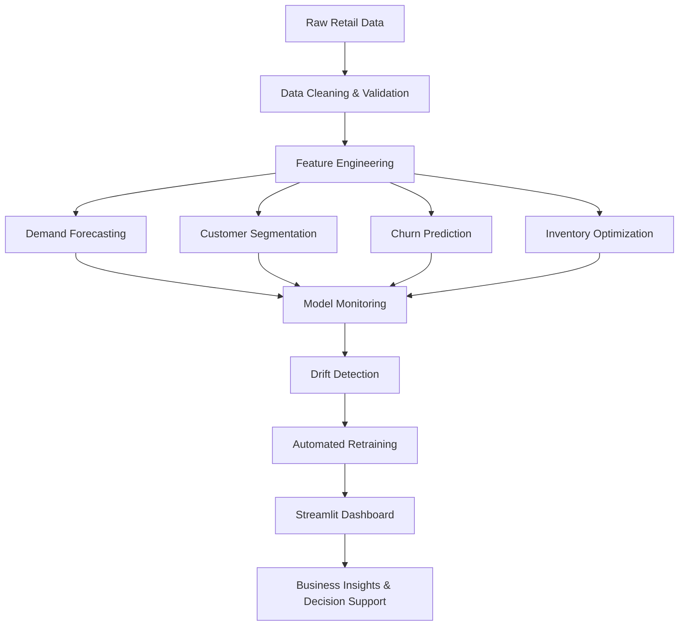
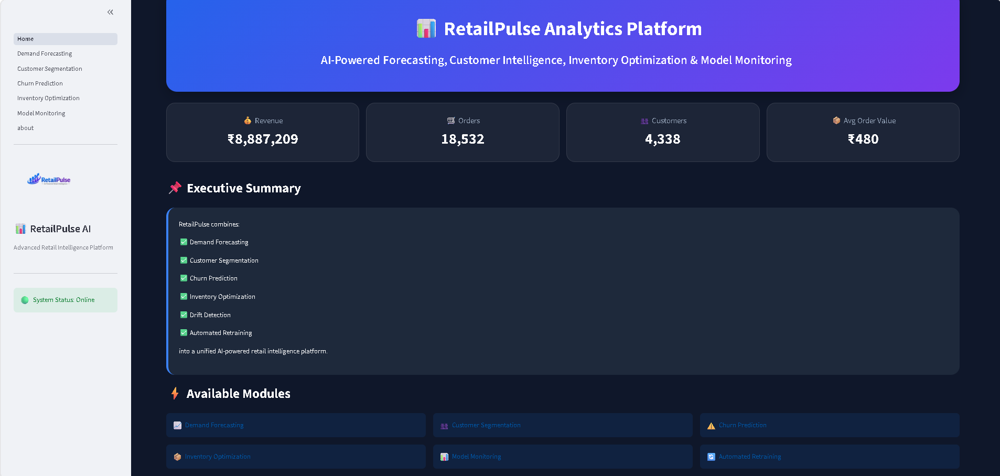
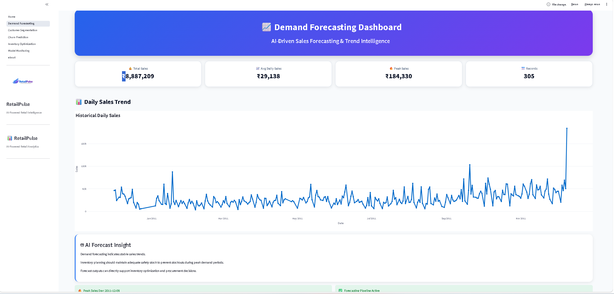
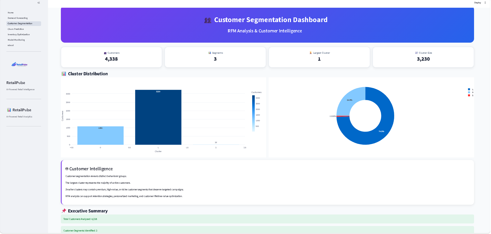
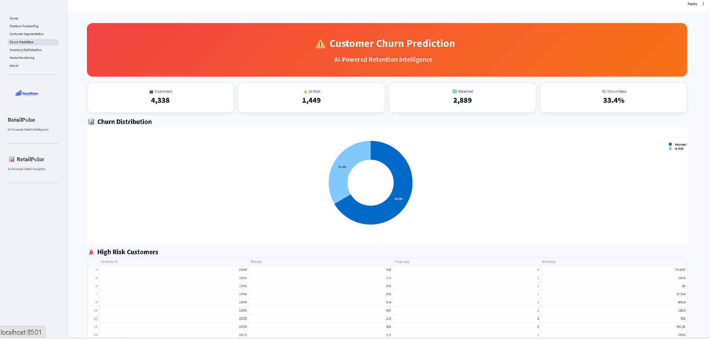
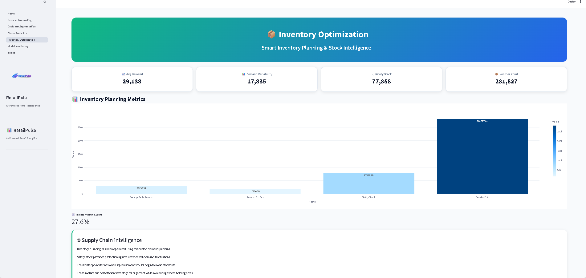
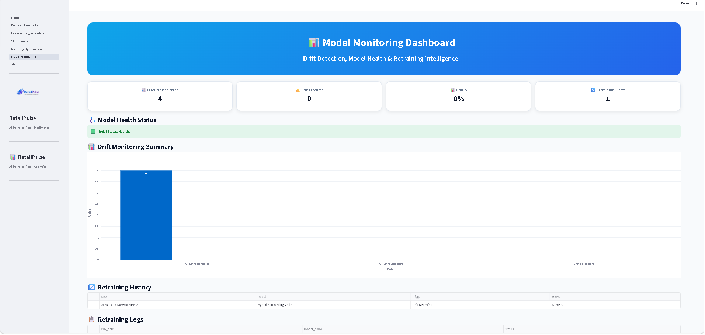

# 📊 RetailPulse AI – Intelligent Retail Analytics Platform


## 🌐 Live Demo

🚀 **Experience the live application here:**

**Streamlit Dashboard:**  
https://retail-analysis-projectgit-udoctr34pjahk65nrw8nlo.streamlit.app

**GitHub Repository:**  
https://github.com/gauthamdhivakar-000/retail-analysis-project

---


## 🚀 Overview

RetailPulse AI is an end-to-end retail analytics platform that combines Data Science, Machine Learning, Forecasting, Customer Analytics, and MLOps into a unified business intelligence solution.

The platform enables retailers to:

* Forecast future demand using advanced time-series models
* Segment customers using RFM analysis and clustering
* Predict customer churn using machine learning
* Optimize inventory levels and reorder points
* Monitor model drift and retraining events
* Visualize insights through an interactive Streamlit dashboard

---

## 🎯 Business Objectives

RetailPulse AI helps organizations answer critical business questions:

* What will future demand look like?
* Which customers are most valuable?
* Which customers are likely to churn?
* How much inventory should be maintained?
* Is the deployed model still reliable?
* When should retraining be triggered?

---


## 🏗️ System Architecture



---

## 📈 Key Features

### Demand Forecasting

* Time Series Analysis
* Prophet Forecasting
* LSTM Forecasting
* Hybrid Forecasting Approach
* Forecast Performance Validation

### Customer Segmentation

* RFM Analysis
* K-Means Clustering
* Customer Group Identification
* Segment-Based Business Insights

### Churn Prediction

* XGBoost Classification Model
* Customer Risk Scoring
* Retention Opportunity Identification

### Inventory Optimization

* Demand-Based Planning
* Safety Stock Calculation
* Reorder Point Estimation
* Inventory Risk Reduction

### Model Monitoring

* Data Drift Detection
* Monitoring Dashboard
* Retraining History Tracking
* Model Health Assessment

---

## 🖥️ Dashboard Modules

### Home Dashboard

Executive overview of business performance and platform status.

### Demand Forecasting

Visual analysis of historical demand patterns and forecasting readiness.

### Customer Segmentation

Cluster analysis and customer distribution insights.

### Churn Prediction

Identification of customers at risk of churn with actionable recommendations.

### Inventory Optimization

Inventory planning metrics and stock management recommendations.

### Model Monitoring

Drift monitoring, retraining history, and model performance tracking.

### About

Project overview, objectives, architecture, and technology stack.

---


## 📷 Dashboard Preview

The RetailPulse dashboard provides a centralized interface for monitoring demand forecasting, customer segmentation, churn prediction, inventory optimization, and model monitoring.

> Add the dashboard screenshots below after uploading them to your repository.

| Home | Demand Forecasting |
|------|------|
|  |  |

| Customer Segmentation | Churn Prediction |
|------|------|
|  |  |

| Inventory Optimization | Model Monitoring |
|------|------|
|  |  |


---


## 🔄 Project Workflow

1. Data Collection
2. Data Cleaning
3. Feature Engineering
4. Exploratory Data Analysis
5. Demand Forecasting
6. Customer Segmentation
7. Churn Prediction
8. Inventory Optimization
9. Drift Detection
10. Dashboard Development
11. Deployment on Streamlit Community Cloud


---


## 🛠️ Technology Stack

### Programming

* Python

### Data Analysis

* Pandas
* NumPy

### Visualization

* Matplotlib
* Seaborn
* Plotly

### Machine Learning

* Scikit-Learn
* XGBoost

### Time Series Forecasting

* Prophet
* LSTM (PyTorch)

### MLOps & Monitoring

* Evidently AI

### Dashboard

* Streamlit

### Development Tools

* Jupyter Notebook
* VS Code
* Git
* GitHub

---

## 📂 Project Structure

```text
retailpulse_project/
│
├── dashboard/
│   ├── Home.py
│   ├── pages/
│   ├── assets/
│   └── utils/
│
├── data/
│   └── processed/
│
├── models/
│
├── reports/
│
├── outputs/
│
├── notebooks/
│
├── requirements.txt
├── README.md
└── .gitignore
```

---

## ⚙️ Installation

Clone the repository:

```bash
git clone https://github.com/gauthamdhivakar-000/retail-analysis-project.git
```

Navigate to the project:

```bash
cd retailpulse_project
```

Install dependencies:

```bash
pip install -r requirements.txt
```

Launch the dashboard:

```bash
streamlit run dashboard/Home.py
```

---


## 🌐 Live Deployment

RetailPulse AI has been successfully deployed on **Streamlit Community Cloud** and is publicly accessible.

**Live Application**

https://retail-analysis-projectgit-udoctr34pjahk65nrw8nlo.streamlit.app

Deployment includes:

- Interactive Streamlit Dashboard
- Multi-page Navigation
- Automated dependency installation
- GitHub integration
- Cloud hosting

The application is configured to launch using:

```bash
dashboard/Home.py

### Deployment Files

* requirements.txt
* packages.txt
* README.md
* .gitignore

The application follows a production-ready modular structure for scalable deployment and maintenance.


---

## 📊 Business Impact

RetailPulse AI transforms raw retail data into actionable intelligence by:

* Improving demand planning accuracy
* Reducing stockouts and excess inventory
* Increasing customer retention
* Supporting targeted marketing strategies
* Monitoring model reliability in production

---

## 📂 Dataset

This project uses the **Online Retail Dataset**, which contains transactional records from a UK-based online retail store.

The dataset includes:

- Invoice Number
- Product Description
- Quantity
- Invoice Date
- Unit Price
- Customer ID
- Country

The data is cleaned, transformed, and enriched through feature engineering before being used for analytics and machine learning models.


---


## 📊 Project Highlights

* ✅ End-to-End Data Science Pipeline
* ✅ Time Series Forecasting (Prophet + LSTM + Hybrid)
* ✅ Customer Segmentation using RFM Analysis
* ✅ Machine Learning Churn Prediction
* ✅ Inventory Optimization Framework
* ✅ Data Drift Detection & Monitoring
* ✅ Automated Retraining Workflow
* ✅ Interactive Streamlit Dashboard
* ✅ GitHub Version Control
* ✅ Deployment-Ready Architecture


---


## 📌 Repository Features

- Modular project architecture
- Organized source code
- Notebook-based development workflow
- Automated CI workflow using GitHub Actions
- Docker support
- Streamlit Cloud deployment
- Easy local setup


---

## 🌟 Highlights

* End-to-End Data Science Project
* Machine Learning + Deep Learning
* Forecasting + Customer Analytics
* MLOps Monitoring Workflow
* Interactive Business Dashboard
* Production-Ready Project Structure

---


## 🎓 Skills Demonstrated

- Data Cleaning & Preprocessing
- Exploratory Data Analysis (EDA)
- Time Series Forecasting
- Deep Learning (LSTM)
- Machine Learning (XGBoost)
- Customer Analytics
- Inventory Optimization
- MLOps & Model Monitoring
- Dashboard Development
- Git & GitHub
- Business Intelligence


---

## 🚀 Future Enhancements

- Real-time retail data integration
- Sales prediction API
- User authentication
- Cloud database integration
- Automated model retraining scheduling
- Role-based dashboards
- Enhanced monitoring and alerting


## 👨‍💻 Author

**Gautham**

Data Science & Analytics Project Portfolio

---
## 🙏 Acknowledgement

This project was developed as part of a Data Science & Analytics Internship to demonstrate practical applications of machine learning, forecasting, customer analytics, and business intelligence. It reflects the complete development lifecycle, from data preparation to deployment of an interactive analytics dashboard.


## 📜 License

This project is intended for educational and portfolio purposes.
